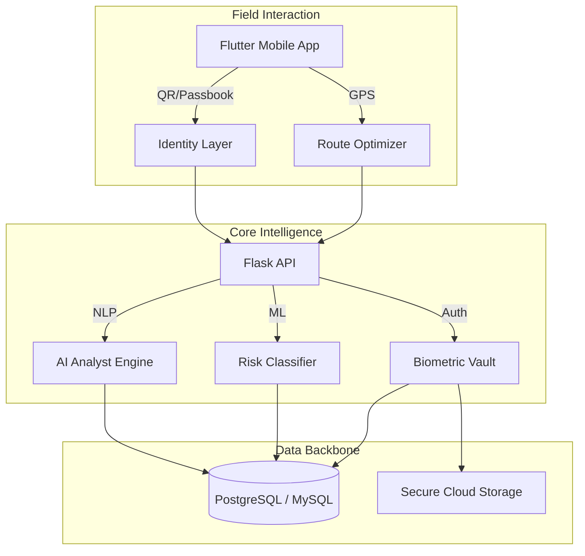

<div align="center">


# VASOOL DRIVE
**AI-Powered Financial Intelligence & Recovery System**

[](https://flutter.dev/)
[](https://www.python.org/)
[](https://www.mysql.com/)
[](https://github.com/)

[Overview](#-overview) • [Features](#-features) • [Screenshots](#-screenshots) • [Architecture](#-architecture) • [Getting Started](#-getting-started)

</div>

---

## 🚀 Overview

**Vasool Drive** is a premium, next-generation fintech platform designed for precision micro-finance operations. Developed for the Tamil-first ecosystem, it bridges the gap between field agility and administrative control. With a focus on **visual excellence**, **AI-driven insights**, and **mathematical stability**, Vasool Drive transforms daily collections into a data-backed growth engine.

## ✨ Features

### 🧠 Intelligent Analytics (Phase 15+)
- **AI Financial Analyst**: Natural language interface for admins to query performance trends and liquidity forecasts.
- **Risk Prediction**: Sophisticated ML models that flag "Problem Loans" before they default.
- **Daily Recovery Pulse**: Real-time progress tracking against daily targets with live agent leaderboards.

### 🔐 Multi-Layer Security
- **Biometric Login**: Secure face verification powered by FaceNet embeddings.
- **Digital Identity**: Encrypted QR-based **Customer Passbooks** for instant, tamper-proof identification.
- **Audit Logs**: Transparent, real-time tracking of every administrative and field action.

### 📱 Premium Field Experience
- **Dynamic Route Optimization**: Smart sequencing of customers based on GPS and payment priority.
- **Zero-Crash Architecture**: Robust null-safety and defensive programming for 100% uptime in low-connectivity areas.
- **Unified Collection Flow**: Streamlined UPI and Cash entry with automated receipt generation.

### 📊 Modern Admin Console
- **Glassmorphic UI**: High-fidelity dashboard with vibrant data visualizations and smooth micro-animations.
- **Granular Line Management**: Detailed oversight of collection routes (Lines) with sequence reordering.
- **One-Click Reports**: Generate professional PDF reports with total collection tallies and breakdown.

---

## 🏗 Architecture



## ⚡ Getting Started

### Prerequisites
- **Flutter SDK**: 3.22+
- **Python**: 3.9+
- **Database**: MySQL 8.0 or PostgreSQL

### Setup & Installation

I've streamlined the setup process to be as fast as possible:

1. **Backend**:
   ```bash
   cd backend
   pip install -r requirements.txt
   python app.py
   ```

2. **Frontend**:
   ```bash
   cd frontend
   flutter pub get
   flutter run
   ```

## 🛡 Stability Highlights
The system has been rigorously optimized for the latest Flutter SDK:
- ✅ **0 Analysis Issues**: Clean code compliant with strict linting rules.
- ✅ **Standardized UI**: Consistent use of Material Design 3 patterns (`RadioListTile`, `withValues`).
- ✅ **Fault Tolerant**: Comprehensive null guards across all API interaction layers.
- ✅ **CI/CD Ready**: Automated Android builds and backend checks via GitHub Actions.

## 🛠 Configuration
### N8n AI Agent Integration
To connect your AI agents (Auto-Accounting & Error Detection):
1. Log in as **Admin**.
2. Navigate to **Master Settings** -> **AI Agent Configuration**.
3. Paste your N8n Webhook URL. The system will use this URL for all AI-driven operations.

### PostgreSQL Migration
The system is fully compatible with PostgreSQL (Render). Ensure your `DATABASE_URL` is set in the environment variables.

---

## 📜 License
&copy; 2026 Vasool Drive. All Rights Reserved.  
*Engineered for Advanced Agentic Finance Operations.*
